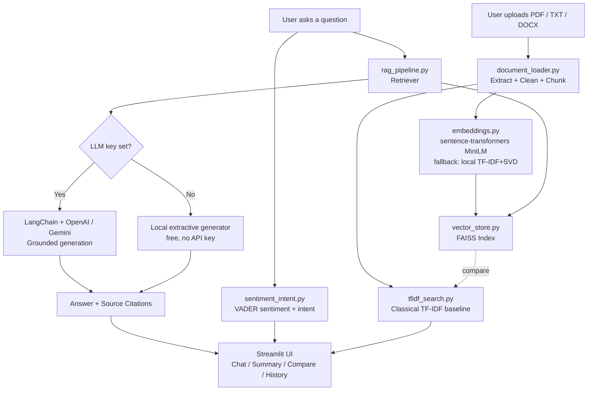

# 🧠 IntelliAssist AI: Smart Document AI Assistant

An AI-powered chatbot that lets users upload documents (PDF, TXT, DOCX) and ask
questions about them using a Retrieval-Augmented Generation (RAG) pipeline —
built as an AI Internship Capstone Project for LaunchED.

## Problem Statement

Students and businesses struggle to manage and search information across
PDFs, notes, and documents efficiently. Existing AI tools are expensive or
lack custom document understanding.

## Solution Overview

IntelliAssist AI lets users upload documents and ask questions about them.
Using NLP, embeddings, and a RAG architecture, the system gives context-aware
answers, summaries, and document insights — with source citations, entirely
on free/local models by default.

## Features

1. **Document upload** — PDF, TXT, and DOCX
2. **AI chatbot** — answers questions using RAG over the uploaded documents
3. **Semantic search** — using dense embeddings + FAISS
4. **Text summarisation** — of uploaded documents (extractive TextRank)
5. **Sentiment & intent analysis** — of user queries (VADER + rule-based intent)
6. **Source citation display** — shows which document/chunk an answer came from
7. **Conversation history** — persisted within a session
8. **Streamlit web interface** — ties all of the above together

## Architecture



**Text flow in plain terms:** a document is extracted → cleaned → split into
overlapping chunks → each chunk is embedded → embeddings are stored in a
FAISS vector index (and, separately, a TF-IDF index for the classical
baseline). When a user asks a question, the same embedding model encodes the
question, FAISS retrieves the most similar chunks, and those chunks are
either passed to an LLM (if an API key is configured) through a LangChain
prompt, or stitched together by a local extractive generator. Every answer
carries back the exact document name + chunk index it came from.

## Tech Stack

| Layer | Technology |
|---|---|
| Frontend | Streamlit |
| Orchestration | Python, LangChain |
| Embeddings (default) | Hugging Face `sentence-transformers/all-MiniLM-L6-v2` |
| Embeddings (offline fallback) | Local TF-IDF + Truncated SVD (no internet required) |
| Classical NLP baseline | TF-IDF + cosine similarity (scikit-learn) |
| Vector DB | FAISS |
| Generation (optional, paid) | OpenAI / Google Gemini via LangChain |
| Generation (default, free) | Local extractive answer composer |
| Sentiment | VADER (vaderSentiment) |
| Intent | Rule/keyword-based classifier |

## Repository Structure

```
intelliassist/
├── app/
│   └── streamlit_app.py       # Main Streamlit UI
├── src/
│   ├── document_loader.py     # PDF/TXT/DOCX extraction, cleaning, chunking
│   ├── embeddings.py          # sentence-transformers + offline fallback
│   ├── vector_store.py        # FAISS wrapper
│   ├── tfidf_search.py        # Classical TF-IDF baseline
│   ├── summarizer.py          # Extractive TextRank summarisation
│   ├── sentiment_intent.py    # VADER sentiment + intent classifier
│   └── rag_pipeline.py        # RAG orchestration (LangChain + FAISS)
├── data/
│   └── sample_docs/           # 3 real sample docs (pdf, docx, txt)
├── tests/
│   └── test_pipeline.py       # Automated tests (pytest)
├── requirements.txt
├── .env.example
├── .streamlit/config.toml
├── Procfile                   # Render/Heroku-style start command
├── render.yaml                # Render.com deployment config
└── README.md
```

## Setup & Run Locally

### 1. Clone and create a virtual environment

```bash
git clone <your-repo-url>
cd intelliassist
python3 -m venv venv
source venv/bin/activate      # Windows: venv\Scripts\activate
```

### 2. Install dependencies

```bash
pip install -r requirements.txt
```

> **Note:** `sentence-transformers` will download the `all-MiniLM-L6-v2`
> model (~90 MB) from the Hugging Face Hub the first time it runs. This
> requires internet access to `huggingface.co`. If that's unavailable (e.g.
> a locked-down network), the app **automatically falls back** to a local,
> dependency-free TF-IDF+SVD embedder — no code changes needed, the app
> still runs end-to-end. This fallback is what was used to test this
> project inside its development sandbox; see the Evaluation Report for
> details.

### 3. (Optional) Configure a paid LLM for generation

```bash
cp .env.example .env
# then edit .env and set OPENAI_API_KEY or GOOGLE_API_KEY
```

This step is **optional**. Without it, the app uses a free local extractive
generator for answers — no cost, no API key required.

### 4. Run the app

```bash
streamlit run app/streamlit_app.py
```

Open the URL Streamlit prints (default `http://localhost:8501`), then:
1. Upload one or more of the sample documents in `data/sample_docs/` (or
   your own PDF/TXT/DOCX files) using the sidebar.
2. Ask a question in the **Chat** tab — the answer will show its source
   citations in an expandable panel.
3. Try the **Summarize** tab on any uploaded document.
4. Try the **TF-IDF vs Semantic Search** tab to compare classical vs
   embedding-based retrieval on the same query.
5. View the full session in the **History** tab.

### 5. Run the automated tests

```bash
pytest tests/ -v
```

## Deployment

### Streamlit Community Cloud
1. Push this repository to GitHub.
2. Go to [share.streamlit.io](https://share.streamlit.io), connect your
   repo, and set the main file path to `app/streamlit_app.py`.
3. (Optional) Add `OPENAI_API_KEY` / `GOOGLE_API_KEY` under app "Secrets"
   if you want LLM-based generation instead of the free local generator.

### Render
This repo includes `render.yaml` and a `Procfile`.
1. Push to GitHub, then create a new **Blueprint** on
   [render.com](https://render.com) pointing at this repo — it will read
   `render.yaml` automatically.
2. Or create a manual **Web Service**: build command
   `pip install -r requirements.txt`, start command from the `Procfile`.
3. Set `OPENAI_API_KEY` / `GOOGLE_API_KEY` as environment variables in the
   Render dashboard if desired (optional).

## Known Limitations

See the Evaluation Report (`docs/Evaluation_Report.docx`) for a full
discussion, including the TF-IDF vs. embedding retrieval comparison and the
network-restricted-sandbox fallback behaviour observed during testing.

## License

Built for educational purposes as part of the LaunchED AI Internship
Capstone Project.
